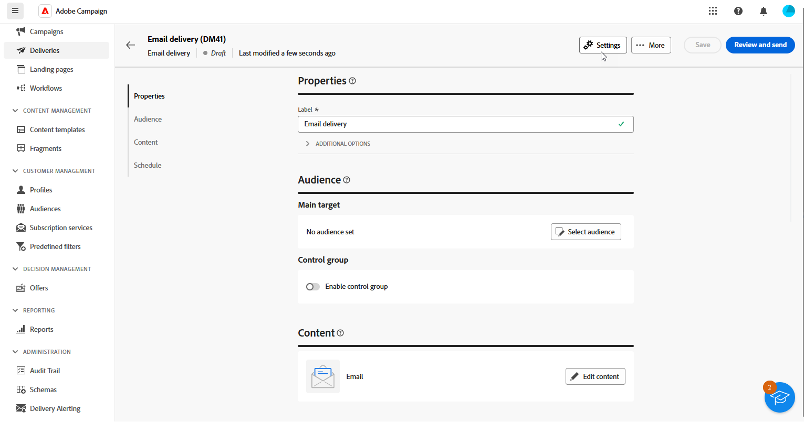

# Attribuer votre marque {#branding-assign}

## Associer une marque à un modèle {#linking-a-brand-to-a-template}

Pour utiliser les paramètres définis pour une marque, elle doit être liée à un modèle de diffusion. Pour ce faire, vous devez créer ou modifier un modèle.

Votre modèle sera lié à la marque. Dans l’éditeur d’e-mail, les éléments comme l’**adresse e-mail de l’expéditeur ou de l’expéditrice par défaut**, le **nom de l’expéditeur ou de l’expéditrice par défaut** ou le **logo** utiliseront les données paramétrées de la marque.

>[!BEGINTABS]

>[!TAB Adobe Campaign V8]

Pour créer un modèle de diffusion, vous pouvez dupliquer un modèle intégré, convertir une diffusion existante en modèle ou créer un modèle de diffusion à partir de zéro. [En savoir plus](https://experienceleague.adobe.com/fr/docs/campaign/campaign-v8/send/create-templates)

Une fois votre modèle créé, vous pouvez le lier à une marque. Pour ce faire :

1. Accédez à **[!UICONTROL Ressources]** `>` **[!UICONTROL Modèles]** `>` **[!UICONTROL Modèles de diffusion]** dans l’explorateur Adobe Campaign.

1. Sélectionnez un modèle de diffusion ou dupliquez un modèle existant.

   

1. Accédez aux **[!UICONTROL Propriétés]** du modèle de diffusion sélectionné.

   

1. Dans l’onglet **[!UICONTROL Général]**, sélectionnez votre marque dans le menu déroulant **[!UICONTROL Branding]**.

   

1. Une fois la configuration effectuée, sélectionnez **OK**.

Vous pouvez maintenant utiliser ce modèle pour envoyer vos diffusions.

>[!TAB Adobe Campaign Web]

Pour créer un modèle de diffusion, vous pouvez dupliquer un modèle intégré, convertir une diffusion existante en modèle ou créer un modèle de diffusion à partir de zéro. [En savoir plus](https://experienceleague.adobe.com/fr/docs/campaign-web/v8/msg/delivery-template)

Une fois votre modèle créé, vous pouvez le lier à une marque. Pour ce faire :

1. Accédez à l’onglet **[!UICONTROL Modèles]** dans le menu de gauche **[!UICONTROL Diffusions]**, puis sélectionnez un modèle de diffusion.

   

1. Cliquez sur **[!UICONTROL Paramètres]**.

   

1. Dans l’onglet **[!UICONTROL Diffusion]**, accédez au champ **[!UICONTROL Branding]** et sélectionnez la marque que vous souhaitez lier au modèle.

   

1. Validez votre sélection et enregistrez votre modèle.

Vous pouvez maintenant utiliser ce modèle pour envoyer vos diffusions.

>[!ENDTABS]

## Attribuer une marque à votre diffusion {#assigning-a-brand-to-an-email}

>[!BEGINTABS]

>[!TAB Adobe Campaign V8]

Pour créer une diffusion autonome, procédez comme suit.

1. Pour créer une diffusion, accédez à l’onglet **[!UICONTROL Campagnes]**.

1. Cliquez sur **[!UICONTROL Diffusions]** puis sur le bouton **[!UICONTROL Créer]** au-dessus de la liste des diffusions existantes.

   

1. Sélectionnez un modèle de diffusion.

1. Accédez aux **[!UICONTROL Propriétés]** du modèle de diffusion sélectionné.

   

1. Dans l’onglet **[!UICONTROL Général]**, sélectionnez votre marque dans le menu déroulant **[!UICONTROL Branding]**.

   

1. Une fois la configuration effectuée, sélectionnez **OK**.

1. Personnalisez davantage vos diffusions. Pour plus d’informations sur la création d’un e-mail, consultez la section [Concevoir et envoyer des e-mails](https://experienceleague.adobe.com/fr/docs/campaign-web/v8/msg/email/create-email).

>[!TAB Adobe Campaign Web]

Pour créer une diffusion autonome, procédez comme suit.

1. Accédez au menu **[!UICONTROL Diffusions]** dans le rail de gauche, puis cliquez sur le bouton **[!UICONTROL Créer une diffusion]**.

   

1. Sélectionnez le canal E-mail ou Notification push et choisissez un modèle de diffusion dans la liste.

1. Cliquez sur le bouton **[!UICONTROL Créer une diffusion]** pour confirmer.

1. Sur la page **[!UICONTROL Propriétés]**, cliquez sur **[!UICONTROL Paramètres]**.

   

1. Dans l’onglet **[!UICONTROL Diffusion]**, accédez au champ **[!UICONTROL Branding]**.

   

1. Sélectionnez la marque que vous souhaitez associer au modèle.

   

1. Personnalisez davantage vos diffusions. Pour plus d’informations sur la création d’un e-mail, consultez la section [Créer votre premier e-mail](https://experienceleague.adobe.com/fr/docs/campaign-web/v8/msg/email/create-email).

>[!ENDTABS]
