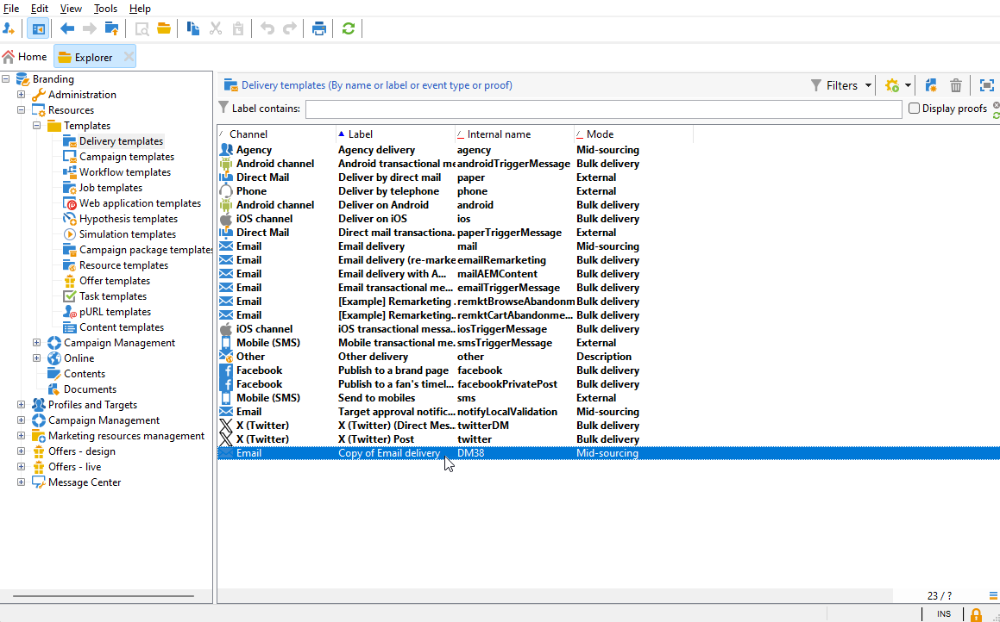

# Attribuer votre marque {#branding-assign}

## Associer une marque à un modèle {#linking-a-brand-to-a-template}

Pour utiliser les paramètres définis pour une marque, elle doit être liée à un modèle de diffusion. Pour cela, vous devez créer ou éditer un modèle.

Votre modèle sera associé à la marque. Dans l&#39;éditeur d&#39;email, les éléments tels que l&#39;**adresse email de l&#39;expéditeur par défaut**, le **nom de l&#39;expéditeur par défaut** ou le **logo** utiliseront les données de marque configurées.

>[!BEGINTABS]

>[!TAB Adobe Campaign V8]

Pour créer un modèle de diffusion, vous pouvez dupliquer un modèle intégré, convertir une diffusion existante en modèle ou créer entièrement un modèle de diffusion. [En savoir plus](https://experienceleague.adobe.com/fr/docs/campaign/campaign-v8/send/create-templates)

Une fois votre modèle créé, vous pouvez le lier à une marque. Pour ce faire :

1. Accédez à **[!UICONTROL Ressources]** `>` **[!UICONTROL Modèles]** `>` **&#x200B;**&#x200B;dans l’explorateur Adobe Campaign.

1. Sélectionnez un modèle de diffusion ou dupliquez-en un existant.

   

1. Accédez aux **[!UICONTROL Propriétés]** du modèle de diffusion sélectionné.

   

1. Dans l&#39;onglet **[!UICONTROL Général]** , sélectionnez votre marque dans la liste déroulante **[!UICONTROL Marque]** .

   

1. Une fois configuré, sélectionnez **OK**.

Vous pouvez maintenant utiliser ce modèle pour envoyer vos diffusions.

>[!TAB Adobe Campaign Web]

Pour créer un modèle de diffusion, vous pouvez dupliquer un modèle intégré, convertir une diffusion existante en modèle ou créer entièrement un modèle de diffusion. [En savoir plus](https://experienceleague.adobe.com/fr/docs/campaign-web/v8/msg/delivery-template)

Une fois votre modèle créé, vous pouvez le lier à une marque. Pour ce faire :

1. Accédez à l’onglet **[!UICONTROL Modèles]** dans le menu de gauche **[!UICONTROL Diffusions]** et sélectionnez un modèle de diffusion.

   

1. Cliquez sur **[!UICONTROL Paramètres]**.

   

1. Dans l&#39;onglet **[!UICONTROL Diffusion]** , accédez au champ **[!UICONTROL Marque]** et sélectionnez la marque que vous souhaitez lier au modèle.

   

1. Validez votre sélection et enregistrez votre modèle.

Vous pouvez maintenant utiliser ce modèle pour envoyer vos diffusions.

>[!ENDTABS]

## Attribuer une marque à votre diffusion {#assigning-a-brand-to-an-email}

>[!BEGINTABS]

>[!TAB Adobe Campaign V8]

Pour créer une diffusion autonome, procédez comme suit.

1. Pour créer une diffusion, accédez à l&#39;onglet **[!UICONTROL Campagnes]** .

1. Cliquez sur **[!UICONTROL Diffusions]** et cliquez sur le bouton **[!UICONTROL Créer]** situé au-dessus de la liste des diffusions existantes.

   

1. Sélectionnez un modèle de diffusion.

1. Accédez aux **[!UICONTROL Propriétés]** du modèle de diffusion sélectionné.

   

1. Dans l&#39;onglet **[!UICONTROL Général]** , sélectionnez votre marque dans la liste déroulante **[!UICONTROL Marque]** .

   

1. Une fois configuré, sélectionnez **OK**.

1. personnaliser davantage vos diffusions ; Pour plus d&#39;informations sur la création d&#39;un email, reportez-vous à la section [Concevoir et envoyer des emails](https://experienceleague.adobe.com/fr/docs/campaign-web/v8/msg/email/create-email) .

>[!TAB Adobe Campaign Web]

Pour créer une diffusion autonome, procédez comme suit.

1. Accédez au menu **[!UICONTROL Diffusions]** sur le rail de gauche, puis cliquez sur le bouton **[!UICONTROL Créer une diffusion]** .

   

1. Sélectionnez Email ou Notification push comme canal et choisissez un modèle de diffusion dans la liste.

1. Cliquez sur le bouton **[!UICONTROL Créer une diffusion]** pour confirmer.

1. Sur la page **[!UICONTROL Propriétés]**, cliquez sur **[!UICONTROL Paramètres]**.

   

1. Dans l&#39;onglet **[!UICONTROL Diffusion]**, accédez au champ **[!UICONTROL Marque]**.

   

1. Sélectionnez la marque que vous souhaitez lier au modèle.

   

1. personnaliser davantage vos diffusions ; Pour plus d&#39;informations sur la création d&#39;un email, reportez-vous à la section [Créer votre premier email](https://experienceleague.adobe.com/fr/docs/campaign-web/v8/msg/email/create-email) .

>[!ENDTABS]
