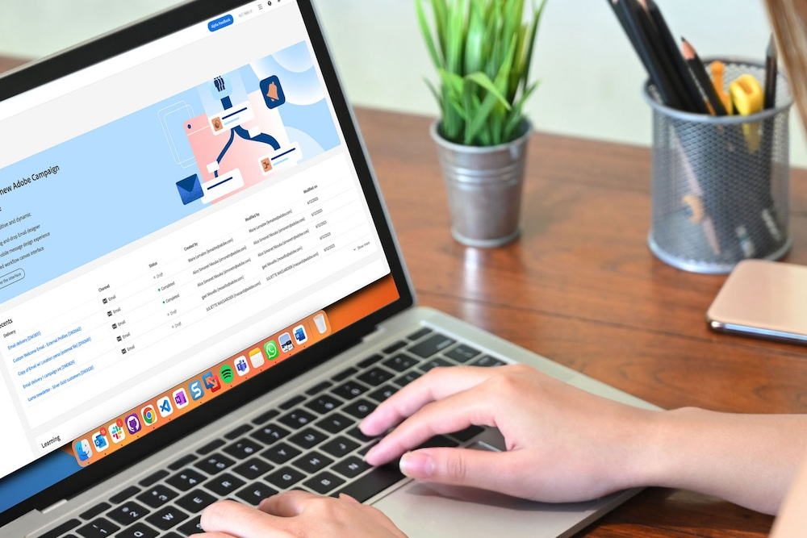

# Transition de Campaign Standard vers Campaign v8 {#triggers-home}

En migrant de Campaign Standard à Campaign v8, vous pouvez maintenant profiter de la toute nouvelle version de l’interface d’utilisation d’Adobe Campaign Web ainsi que de la puissante console v8. La transition est fluide et vous permettra d’utiliser toutes les fonctionnalités intuitives conçues pour simplifier la création de campagnes cross-canal personnalisées. L’interface utilisateur web de Campaign propose également une zone de travail connectée avec Adobe Experience Platform pour une expérience unifiée.

En outre, cette transition aura de nombreux avantages :

* Infrastructure informatique robuste
* Prise en charge améliorée
* Intégration à Adobe Experience Platform
* Interface utilisateur et expérience cohérentes

Pour plus d’informations sur les fonctionnalités clés et les différences de concept, consultez [cette page](https://experienceleague.adobe.com/fr/docs/campaign-web/v8/start/acs-migration).

## Nouveautés

Obtenez un aperçu de toutes les fonctionnalités offertes par [l’interface utilisateur web de Campaign](https://experienceleague.adobe.com/fr/docs/campaign-web/v8/campaign-web-home) et [Campaign v8](https://experienceleague.adobe.com/fr/docs/campaign/campaign-v8/campaign-home).

Pour que vous puissiez effectuer une transition en toute simplicité, nous avons ajouté des fonctionnalités essentielles de Campaign Standard vers v8 :

>[!BEGINTABS]

>[!TAB Rapports dynamiques]

Vous pouvez accéder aux rapports dynamiques , qui fournissent des rapports entièrement personnalisables et en temps réel pour mesurer l’impact de vos activités marketing.

>[!TAB Image de marque centralisée]

Vos administrateurs techniques peuvent désormais définir une ou plusieurs marques pour centraliser les paramètres affectant l&#39;identité d&#39;une marque.

>[!TAB API Rest]

Vous pouvez utiliser les API Rest pour créer des intégrations pour Adobe Campaign et créer votre propre écosystème en interfaçant Adobe Campaign avec le panneau de technologies que vous utilisez.

>[!ENDTABS]

## Commencer avec les principes de base

<table style="table-layout:fixed">
  <tr style="border: 0;">
    <td>
    
    
<strong>Découvrez la nouvelle interface utilisateur</strong> .

    </td>
    <td>
    
    
<strong>Zone de travail de workflow repensée</strong> 
 
    </td>
    <td>
    
    
<strong>Présentation du concepteur d’e-mail</strong> 
    
</td>
    <td>
    
    
<strong>Rendre votre contenu dynamique</strong> 

    </td>
  </tr>
  <tr style="border: 0;">
    <td align="center"></td>
    <td align="center"></td>
    <td align="center"></td>
    <td align="center"></td>
    </tr>
</table>

