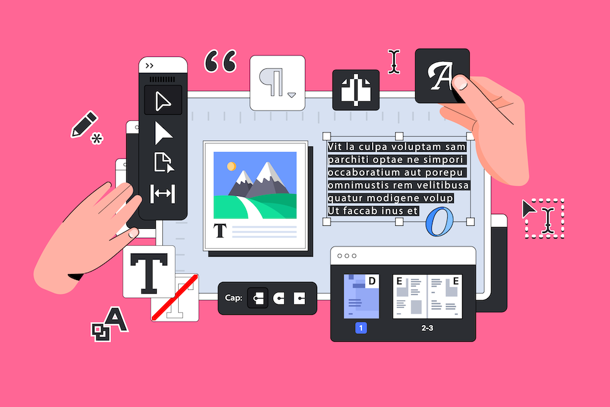

# Transition Campaign Standard vers Campaign v8 {#triggers-home}

En tant qu’utilisateur Campaign Standard passant à Campaign v8, vous pouvez désormais bénéficier de la nouvelle version de l’interface utilisateur web d’Adobe Campaign et de la puissante console v8. La transition est transparente et vous permettra d’utiliser toutes les fonctionnalités intuitives conçues pour simplifier la création de campagnes cross-canal personnalisées. L’interface utilisateur web de Campaign contient également un canevas connecté avec Adobe Experience Platform pour une expérience unifiée.

En outre, cette transition sera porteuse de nombreux avantages :

* Une infrastructure informatique robuste
* Prise en charge améliorée
* Intégration à Adobe Experience Platform
* Interface utilisateur et expérience cohérentes

Pour plus d’informations sur les principales fonctionnalités et les différences de concept, reportez-vous à la section [cette page](https://experienceleague.adobe.com/en/docs/campaign-web/v8/rn/acs-migration.html).

## Nouveautés

Découvrez toutes les fonctionnalités offertes par [Interface utilisateur Web de Campaign](https://experienceleague.adobe.com/en/docs/campaign-web/v8/campaign-web-home) et [Campaign v8](https://experienceleague.adobe.com/fr/docs/campaign/campaign-v8/campaign-home).

Pour que vous puissiez passer de Campaign Standard à v8, nous avons ajouté des fonctionnalités clés :

>[!BEGINTABS]

>[!TAB Rapports dynamiques]

Vous pouvez accéder aux rapports dynamiques qui fournissent des rapports en temps réel entièrement personnalisables pour mesurer l’impact de vos activités marketing.

>[!TAB Marque centralisée]

Vos administrateurs techniques peuvent maintenant définir une ou plusieurs marques pour centraliser les paramètres qui affectent l’identité d’une marque.

>[!TAB API REST]

Vous pouvez utiliser les API REST pour créer des intégrations pour Adobe Campaign et créer votre propre écosystème en interfaçant Adobe Campaign avec le panneau des technologies que vous utilisez.

>[!ENDTABS]

## Commencer avec les principes de base

<table style="table-layout:fixed">
  <tr style="border: 0;">
    <td>
    
    
<strong>Découvrez la nouvelle interface utilisateur</strong> .

    </td>
    <td>
    
    
<strong>Canevas de workflow repensé</strong> 
 
    </td>
    <td>
    
    
<strong>Présentation du concepteur d’e-mail</strong> 
    
</td>
    <td>
    
    
<strong>Rendre votre contenu dynamique</strong> 

    </td>
  </tr>
  <tr style="border: 0;">
    <td align="center"></td>
    <td align="center"></td>
    <td align="center"></td>
    <td align="center"></td>
    </tr>
</table>
