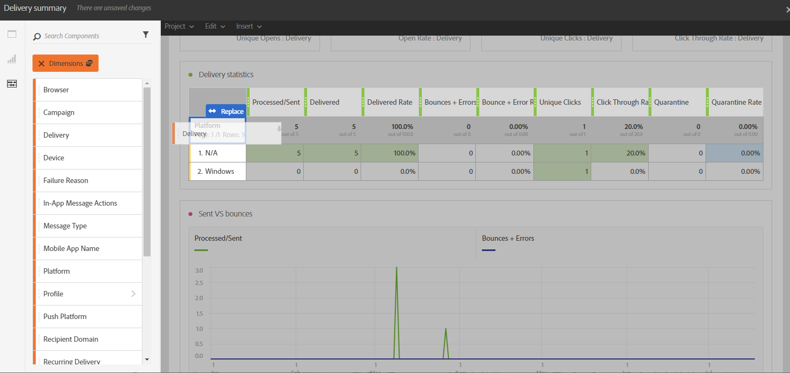

# Ajouter des composants{#adding-components}

Les composants vous permettent de personnaliser vos rapports grâce à différentes dimensions, valeurs métriques et périodes.

1. Cliquez sur l’onglet **[!UICONTROL Composants]** pour accéder à la liste des composants.

   

1. Chaque catégorie présentée dans l&#39;onglet **[!UICONTROL Composants]** affiche les cinq éléments les plus utilisés. Cliquez sur le nom d&#39;une catégorie pour accéder à la liste complète de ses composants.

   Le tableau des composants est divisé en quatre catégories :

   * **Dimensions** : obtenez des détails issus du log de diffusion, tels que le navigateur du destinataire, son domaine, ou la réussite d’une diffusion.
   * **Mesures** : obtenez des détails sur le statut d&#39;un message. Par exemple, si un message a été délivré et que l’utilisateur l’a ouvert.
   * **[!UICONTROL Segments]** : filtrez les données selon la tranche d&#39;âge du destinataire. Les **[!UICONTROL segments]** peuvent être placés directement dans un tableau à structure libre ou dans la barre supérieure du panneau.

     Cette catégorie est disponible uniquement lorsque l&#39;administrateur a accepté les conditions générales de l&#39;accord sur l&#39;utilisation des rapports dynamiques qui s&#39;affiche à l&#39;écran. Si l&#39;administrateur refuse les conditions générales de l&#39;accord, les segments ne sont pas visibles dans l&#39;onglet **[!UICONTROL Composants]** et les données ne sont pas collectées.

   * **Heure** : définissez une période pour votre tableau.

1. Faites glisser des composants dans un panneau pour commencer à filtrer vos données.

   

1. Après avoir fait un glisser-déposer de votre composant, vous pouvez continuer à configurer votre tableau à l’aide de l’option **[!UICONTROL Paramètres de ligne]**.

   

1. Vous pouvez également filtrer davantage votre tableau en cliquant sur l’icône **Rechercher**. Avec cette recherche, vous pouvez rechercher des résultats spécifiques, tels qu’une diffusion ou un navigateur spécifique, par exemple.

   

Vous pouvez faire glisser autant de composants que nécessaire et les comparer.

**Rubriques connexes :**

* [Liste des composants](list-of-components.md)
* [Liste des rapports](defining-the-report-period.md)
