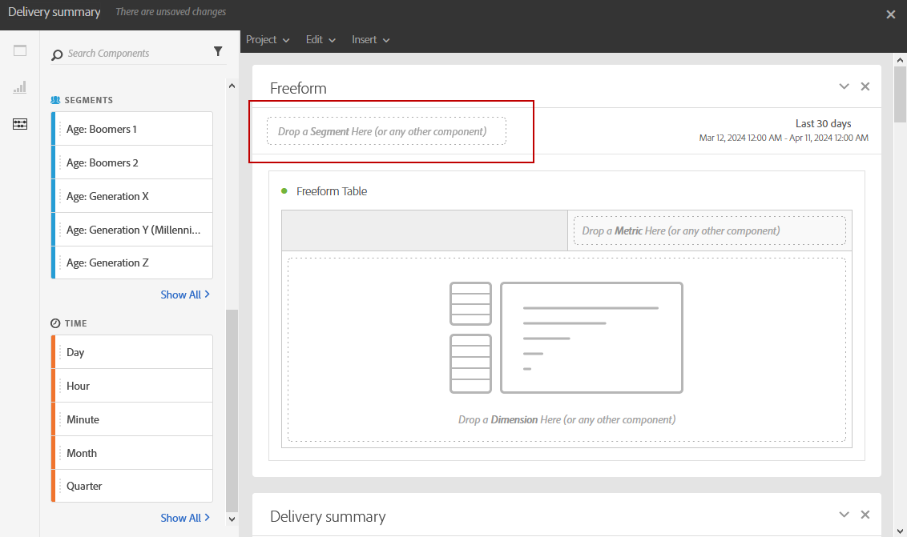

# Ajout de panneaux{#adding-panels}

## Ajout d’un panneau vierge {#adding-a-blank-panel}

Pour commencer votre rapport, vous pouvez ajouter un ensemble de panneaux à un rapport d&#39;usine ou personnalisé. Chaque panneau contient différents jeux de données et est composé de tableaux à structure libre et de visualisations.

Ce panneau vous permet de créer vos rapports selon vos besoins. Vous pouvez ajouter autant de panneaux que vous le souhaitez dans vos rapports afin de filtrer vos données selon différentes périodes.

1. Cliquez sur l&#39;icône **Panneaux.** Vous pouvez également ajouter un panneau en cliquant sur l&#39;onglet **Insertion** et en sélectionnant **Nouveau panneau vierge**.

   

1. Placez le **panneau vierge** dans votre tableau de bord.

   

Vous pouvez maintenant ajouter un tableau à structure libre à votre panneau pour commencer le ciblage des données.

## Ajout d’un tableau à structure libre {#adding-a-freeform-table}

Les tableaux Structure libre vous permettent de créer un tableau pour analyser vos données à l&#39;aide des différentes valeurs métriques et des dimensions disponibles dans le tableau **Composant**.

Chaque tableau et chaque visualisation peuvent être redimensionnés et déplacés afin de mieux personnaliser votre rapport.

1. Cliquez sur l&#39;icône **[!UICONTROL Panneaux]**.

   

1. Placez l&#39;élément **[!UICONTROL Structure libre]** sur votre tableau de bord.

   Vous pouvez également ajouter un tableau en cliquant sur l&#39;onglet **[!UICONTROL Insérer]** et en sélectionnant **[!UICONTROL Nouvelle Forme Libre]** ou en cliquant sur **[!UICONTROL Ajouter un panneau structure libre]** dans un panneau vide.

   

1. Dans le champ **[!UICONTROL Déposer un segment ici]**, ajoutez un **[!UICONTROL segment]** de l’onglet **[!UICONTROL Composants]** dans la barre supérieure.

   

1. Positionnez des éléments de l&#39;onglet **[!UICONTROL Composants]** dans les colonnes et les rangées pour créer votre tableau.

   

1. Cliquez sur l&#39;icône **[!UICONTROL Paramètres]** pour modifier l&#39;affichage des données dans vos colonnes.

   

   L&#39;option **[!UICONTROL Paramètres de colonne]** est composée des éléments suivants :

   * **[!UICONTROL Nombre]** : permet d&#39;afficher ou de masquer les nombres de synthèse dans la colonne.
   * **[!UICONTROL Pourcentage]** : permet d&#39;afficher ou de masquer le pourcentage dans la colonne.
   * **[!UICONTROL Interpréter zéro comme n&#39;étant pas une valeur]** : permet d&#39;afficher ou de masquer une valeur lorsqu&#39;elle est égale à zéro.
   * **[!UICONTROL Arrière-plan]** : permet d&#39;afficher ou de masquer la barre de progression horizontale dans les cellules.
   * **[!UICONTROL Inclure les nouvelles tentatives]** : permet d&#39;inclure les nouvelles tentatives dans le résultat. Cette option est uniquement disponible pour les éléments **[!UICONTROL Envoyés]** et **[!UICONTROL Bounces + erreurs]**.

1. Sélectionnez une ou plusieurs rangées et cliquez sur l&#39;icône **[!UICONTROL Visualiser.]** Une visualisation est ajoutée pour refléter les lignes sélectionnées.

   

Vous pouvez maintenant ajouter autant de composants que nécessaire et également des visualisations pour donner des représentations graphiques de vos données.
