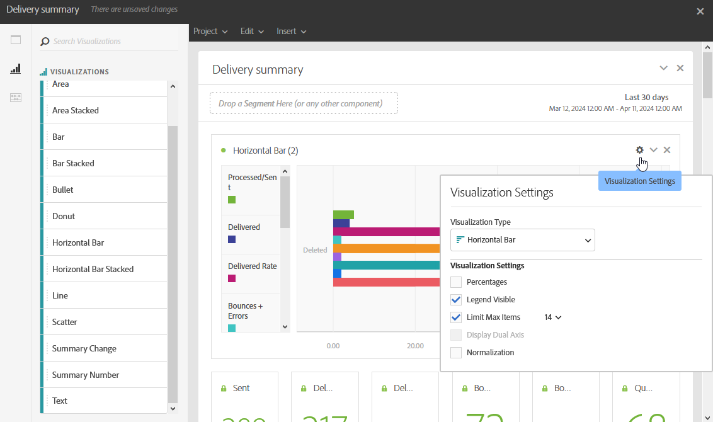

# Ajout de visualisations{#adding-visualizations}

L’onglet **Visualisations** vous permet de positionner des éléments de visualisation, tels que des zones, des diagrammes circulaires ou des graphiques. Les visualisations vous donnent une représentation graphique de vos données.

1. Dans l’onglet **[!UICONTROL Visualisations]**, déposez un élément de visualisation dans un panneau.

   

1. Après avoir ajouté une visualisation à votre panneau, Rapports Dynamiques détecte automatiquement les données dans votre tableau Structure libre. Sélectionnez les paramètres de votre visualisation.
1. S’il existe plusieurs tableaux à structure libre, sélectionnez la source de données à ajouter à votre graphique dans la fenêtre **Paramètres de source de données.** Cette fenêtre est également disponible en cliquant sur le point coloré en regard du titre de votre visualisation.

   

1. Cliquez sur le bouton des paramètres de **[!UICONTROL Visualisation]** pour modifier directement le type de graphique ou les données qui y sont affichées :

   * **Pourcentages** : affiche les valeurs en pourcentage.
   * **Ancrer l’axe Y à zéro** : force l’axe Y à zéro, même si des valeurs sont supérieures à zéro.
   * **Légende visible** : permet de masquer la légende.
   * **Normalisation** : force les valeurs à correspondre.
   * **Afficher l’axe double** : ajoute un axe à votre graphique.
   * **Limiter le nombre d&#39;éléments max.** : limite le nombre de graphiques affichés.
   * **Seuil** : permet de configurer un seuil pour votre graphique. Il apparaît sous la forme d&#39;une ligne pointillée noire.

   

Cette visualisation vous permet d’avoir une vue plus claire de vos données dans les rapports.
