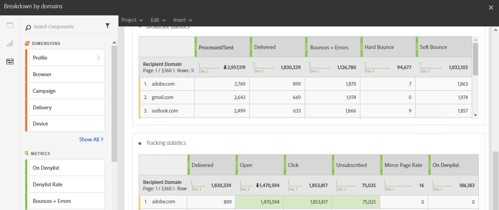

# Répartition par domaine{#breakdown-by-domains}

Ce rapport contient les données de performance pour chaque domaine représenté dans l’audience pour une diffusion email. S’il s’agit d’un rapport de campagne ou de programme, les données de performances sont disponibles pour plusieurs audiences. Ces données vous permettent d’analyser le comportement de chaque domaine en réaction à des événements spécifiques. Par exemple l’affichage de liens, le placement d’URL sur la liste bloquée, etc.

Le tableau **Statistiques d&#39;émission** contient les données disponibles liées aux erreurs possibles rencontrées pour chaque domaine, telles que :

* **Traités/envoyés** : nombre d’emails envoyés.
* **Délivrés** : nombre d’emails délivrés.
* **Bounces + erreurs** : nombre de messages qui n’ont pas pu être remis.
* **Hard bounce** : nombre total d’erreurs permanentes, telles qu’une adresse électronique incorrecte.
* **Soft bounce** : nombre total d’erreurs temporaires, telles qu’une boîte de réception pleine.

Le deuxième tableau, **Statistiques de tracking**, contient les données disponibles pour la réactivité des destinataires à la diffusion, telles que :

* **Délivrés** : nombre d’emails délivrés
* **Ouvrir** : nombre d’ouvertures d’un message dans une diffusion.
* **Clic** : nombre de clics sur le contenu dans une diffusion.
* **Désabonnement** : nombre de clics sur le lien de désinscription.
* **Page miroir** : nombre de clics sur le lien de la page miroir.
* **À la liste bloquée** : nombre de destinataires ayant déclaré un email comme étant un spam ou un courrier indésirable.
