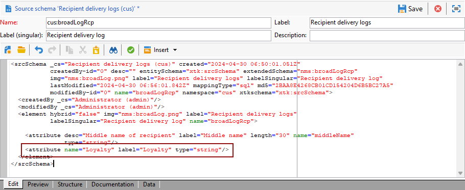

# Créer une dimension de profil{#creating-a-custom-profile-dimension}

Les rapports peuvent également être créés et gérés en fonction des données de profil créées lors de l&#39;extension du schéma des destinataires.

* [Etape 1 : Etendre le schéma de vos destinataires](##extend-schema)
* [Étape 2 : lier votre nouveau champ personnalisé](#link-custom)
* [Etape 3 : créer un rapport dynamique pour filtrer les destinataires avec la dimension Profil](#create-report)

## Etape 1 : Etendre le schéma de vos destinataires {#extend-schema}

Pour ajouter un nouveau champ de profil, vous devez étendre votre schéma, procédez comme suit :

1. Accédez au dossier **[!UICONTROL Administration]** > **[!UICONTROL Configuration]** > **[!UICONTROL Schémas de données]** dans l’Explorateur.

   

1. Identifiez votre schéma de destinataire personnalisé et sélectionnez-le. Si vous n&#39;avez pas encore étendu le schéma nms:recipient intégré, reportez-vous à [cette procédure](https://experienceleague.adobe.com/en/docs/campaign/campaign-v8/developer/shemas-forms/extend-schema).

1. Ajoutez votre champ personnalisé à l’éditeur de schéma.

   Par exemple, pour ajouter un champ personnalisé Loyalty dans votre schéma de destinataire :

   ```
   <attribute label="Loyalty" name="loyalty" type="string"/>
   ```

   

1. Cliquez sur **[!UICONTROL Enregistrer]**.

1. Identifiez ensuite votre schéma broadLogRcp personnalisé et sélectionnez-le. Si vous n&#39;avez pas encore étendu le schéma de log de diffusion intégré, reportez-vous à [cette procédure](https://experienceleague.adobe.com/en/docs/campaign/campaign-v8/developer/shemas-forms/extend-schema).

1. Ajoutez le même champ personnalisé que votre schéma Destinataire dans l’éditeur de schéma.

   

1. Cliquez sur **[!UICONTROL Enregistrer]**.

1. Pour appliquer les modifications apportées aux schémas, lancez l&#39;assistant de mise à jour de la base de données via **[!UICONTROL Outils]** > **[!UICONTROL Avancé]** > **[!UICONTROL Mettre à jour la structure de la base de données]** et exécutez la commande Mettre à jour la structure de la base de données. [En savoir plus](https://experienceleague.adobe.com/en/docs/campaign/campaign-v8/developer/shemas-forms/update-database-structure)

   

Votre nouveau champ de profil est maintenant prêt à être utilisé et sélectionné par vos destinataires.

## Étape 2 : lier votre nouveau champ personnalisé {#link-custom}

>[!NOTE]
>
> Vous pouvez uniquement ajouter jusqu’à 20 champs personnalisés au rapport dynamique.

Maintenant que votre champ de profil est créé, nous devons le lier à la dimension de reporting dynamique correspondante.

Avant d&#39;étendre le log avec notre champ de profil, vérifiez que la fenêtre des PII a été acceptée pour pouvoir envoyer des données de PII au rapport dynamique. Pour en savoir plus à ce sujet, consultez cette [page](pii-agreement.md).

1. Accédez au dossier **[!UICONTROL Administration]** > **[!UICONTROL Configuration]** > **[!UICONTROL Schémas de données]** > **[!UICONTROL Champ de création de rapports supplémentaire]** dans l’Explorateur.

   

1. Cliquez sur **[!UICONTROL Nouveau]** pour créer la dimension de création de rapports dynamiques correspondante.

1. Sélectionnez **[!UICONTROL Editer l&#39;expression]** et parcourez le schéma Destinataire pour trouver le champ de profil créé précédemment.

   

1. Cliquez sur **[!UICONTROL Terminer]**.

1. Saisissez votre dimension **[!UICONTROL Étiquette]**, visible dans les rapports dynamiques, puis cliquez sur **[!UICONTROL Enregistrer]**.

   

Votre champ de profil est désormais disponible en tant que dimension de profil dans vos rapports. Pour supprimer la dimension de votre profil, vous pouvez la sélectionner et cliquer sur l’icône **[!UICONTROL Supprimer]** .

Maintenant que le schéma des destinataires a été étendu avec ce champ de profil et votre dimension personnalisée créée, vous pouvez commencer à cibler les destinataires dans les diffusions.

## Etape 3 : créer un rapport dynamique pour filtrer les destinataires avec la dimension Profil {#create-report}

Après l&#39;envoi de votre diffusion, vous pouvez ventiler les rapports à l&#39;aide de la dimension de votre profil.

1. Depuis l&#39;onglet **[!UICONTROL Rapports]**, sélectionnez un rapport aux paramètres d&#39;usine et cliquez sur le bouton **[!UICONTROL Créer]** pour en lancer un à partir de zéro.

   

1. Dans la catégorie **[!UICONTROL Dimensions]** , cliquez sur **[!UICONTROL Profil]** , puis faites glisser et déposez la dimension de votre profil dans votre tableau à structure libre.

   

1. Faites glisser et déposez des mesures pour commencer à filtrer vos données.

1. Faites glisser et déposez une visualisation dans votre espace de travail, le cas échéant.

