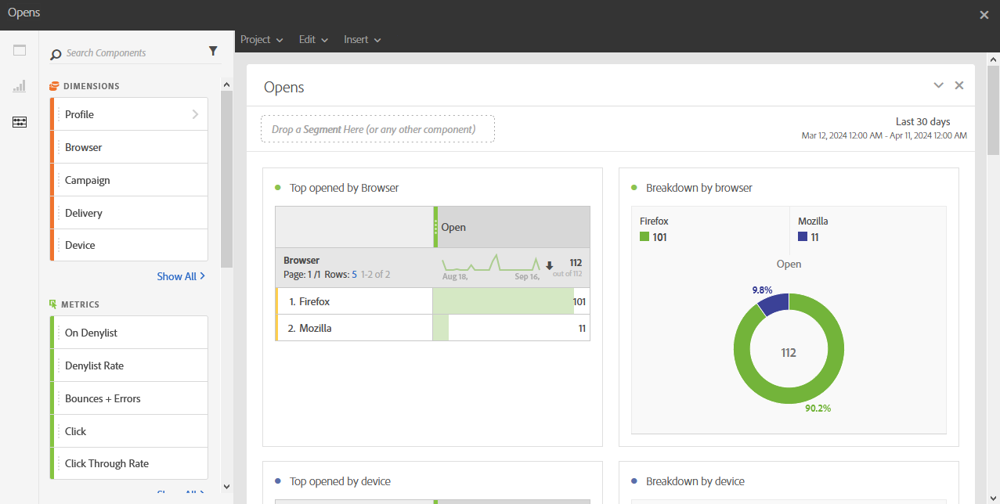

# Ouvertures{#opens}

Le rapport **[!UICONTROL Ouvertures]** permet d’identifier les diffusions qui ont été les plus visionnées par les destinataires.

Quatre tableaux et graphiques répartissent le nombre total de destinataires ayant ouvert un email selon :

* Navigateur
* Appareil
* Platform
* Domaine

Les tableaux et graphiques **[!UICONTROL TOP 5]** affichent les diffusions ayant le plus grand nombre de messages délivrés.
