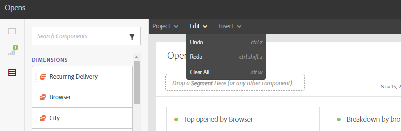

# Interface de reporting{#reporting-interface}

La barre d’outils supérieure vous permet de modifier, d’enregistrer ou d’imprimer votre rapport, par exemple.

Utilisez l’onglet **Projet** pour :

* **Ouvrir...** : ouvre un rapport ou un modèle créé précédemment.
* **Enregistrer sous...** : duplique les modèles pour les rendre modifiables.
* **Actualiser le projet** : met à jour votre rapport en fonction des nouvelles données et des changements de filtre.
* **Télécharger CSV** : exporte vos rapports sous forme de fichier CSV.

L’onglet **Modifier** permet les opérations suivantes :

* **Annuler** : annule la dernière action effectuée sur votre tableau de bord.
* **Effacer tout** : supprime tous les panneaux sur votre tableau de bord.

Le tableau **Insérer** vous permet de personnaliser vos rapports en ajoutant des graphiques et des tableaux à votre tableau de bord :

* **Nouveau panneau vierge** : ajoute un nouveau panneau vierge à votre tableau de bord.
* **Nouvelle structure libre** : ajoute une nouvelle structure libre à votre tableau de bord.
* **Nouvelle ligne** : ajoute un nouveau graphique linéaire à votre tableau de bord.
* **Nouvelle barre** : ajoute un nouveau graphique en barres à votre tableau de bord.

**Rubriques connexes :**

* [Ajout de panneaux](adding-panels.md)
* [Ajout de visualisations](adding-visualizations.md)
* [Ajouter des composants](adding-components.md)

## Onglets {#tabs}

Les onglets de gauche vous permettent de créer votre rapport et de filtrer vos données selon vos besoins.

Ces onglets vous donnent accès aux éléments suivants :

* **[!UICONTROL Panneaux]** : ajoutez un panneau vide ou une forme libre à votre rapport pour commencer à filtrer les données. Pour plus d&#39;informations, consultez la section Ajouter des panneaux.
* **[!UICONTROL Visualisations]** : déposez une sélection d’éléments de visualisation pour donner à votre rapport une dimension graphique. Pour plus d&#39;informations, consultez la section Ajouter des visualisations.
* **[!UICONTROL Composants]** : permettent de personnaliser les rapports grâce à différentes dimensions, mesures, segments et périodes.

## Barre d&#39;outils {#toolbar}

La barre d&#39;outils se trouve au-dessus de votre espace de travail. Composée de différents onglets, elle permet de modifier, d&#39;enregistrer, de partager ou d&#39;imprimer votre rapport, par exemple.

**Rubriques connexes :**

* [Ajout de panneaux](adding-panels.md)
* [Ajout de visualisations](adding-visualizations.md)
* [Ajouter des composants](adding-components.md)

### Onglet Projet {#project-tab}

Utilisez l’onglet **Projet** pour :

* **Ouvrir...** : ouvre un rapport ou un modèle créé précédemment.
* **Enregistrer sous...** : duplique les modèles pour les rendre modifiables.
* **Actualiser le projet** : met à jour votre rapport en fonction des nouvelles données et des changements de filtre.
* **Télécharger CSV** : exporte vos rapports sous forme de fichiers CSV.
* **[!UICONTROL Imprimer]** : imprime votre rapport.

### Onglet Modifier {#edit-tab}

L’onglet **Modifier** permet les opérations suivantes :

* **Annuler** : annule la dernière action effectuée sur votre tableau de bord.
* **Effacer tout** : supprime tous les panneaux sur votre tableau de bord.

### Onglet Insérer {#insert-tab}

L&#39;onglet **Insérer** vous permet de personnaliser vos rapports en ajoutant des graphiques et des tableaux à votre tableau de bord :

* **Nouveau panneau vierge** : ajoute un nouveau panneau vierge à votre tableau de bord.
* **Nouvelle structure libre** : ajoute une nouvelle structure libre à votre tableau de bord.
* **Nouvelle ligne** : ajoute un nouveau graphique linéaire à votre tableau de bord.
* **Nouvelle barre** : ajoute un nouveau graphique en barres à votre tableau de bord.
