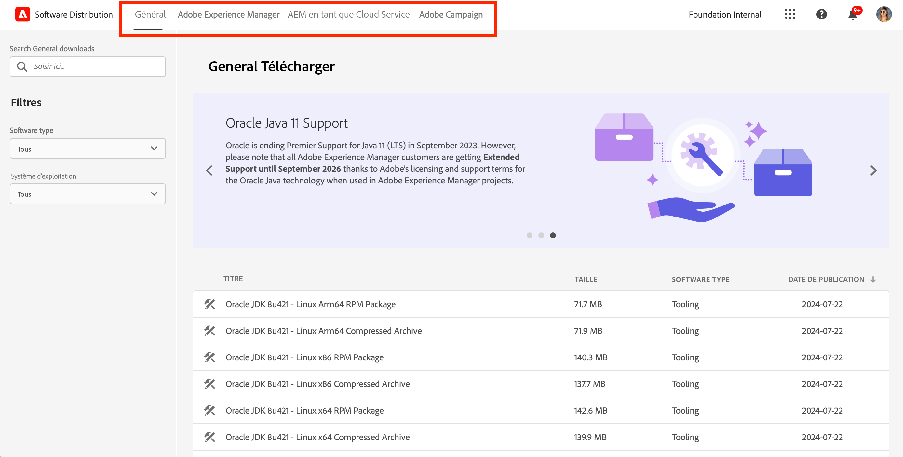
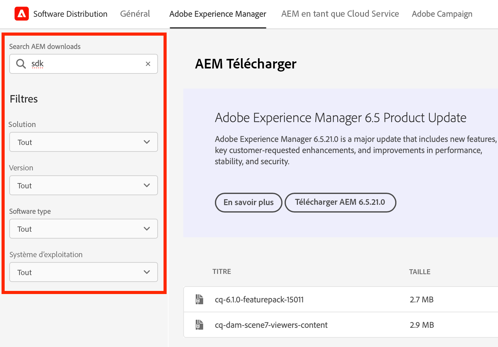
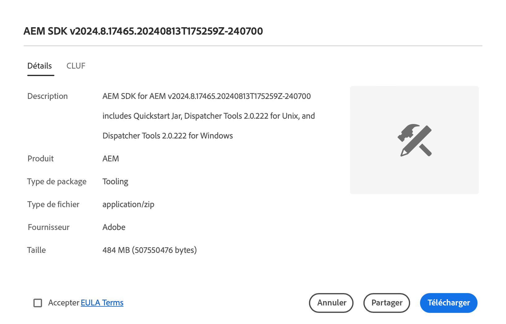

# Software Distribution

Découvrez comment utiliser Software Distribution pour télécharger votre logiciel Adobe Experience Cloud.

## Introduction

Software Distribution offre une expérience efficace pour rechercher et télécharger vos logiciels Adobe Experience Cloud. Les packages logiciels approuvés d’Adobe et les packages de sociétés partenaires sont désormais disponibles pour les produits suivants :

1. **Adobe Experience Manager** - Tout ce qui a trait au service et à la maintenance, à la sécurité, aux outils et plus encore - pour toutes les versions d’AEM prises en charge.
1. **Adobe Experience Manager as a [!UICONTROL Cloud Service]** - [!UICONTROL AEM Cloud SDK], outils de migration [!UICONTROL AEM Cloud], etc.
1. **Adobe Campaign** - Toutes les versions actuelles du programme d’installation de [!DNL Campaign] et les outils connexes.
1. **Général** - Outils d’utilisation générale, y compris les JDK [!DNL Oracle] pour les clientes et clients Adobe.

L’utilisation de Software Distribution est aussi simple que les étapes suivantes :

1. [Accéder à Software Distribution](#accessing)
1. [Sélectionner votre produit](#selecting)
1. [Rechercher votre téléchargement](#finding)
1. [Télécharger votre logiciel](#downloading)

## Accéder à Software Distribution {#accessing}

Pour accéder à Software Distribution, accédez à [`https://experience.adobe.com/downloads`](https://experience.adobe.com/downloads) et connectez-vous à [!UICONTROL Software Distribution] avec votre Adobe ID.

## Sélectionner votre produit {#selecting}

L’IU de Software Distribution est organisée par produit, comme indiqué dans le menu.

Vous accédez à l’onglet **Général** où vous pouvez trouver des téléchargements de logiciels d’usage général.

Appuyez ou cliquez sur le produit dans le menu pour lequel vous souhaitez télécharger un logiciel. Seuls les produits sous licence dans votre entreprise peuvent être téléchargés.

## Rechercher votre téléchargement {#finding}

Lorsque vous avez sélectionné l’onglet de produit souhaité, tous les téléchargements associés s’affichent. Utilisez les filtres de recherche dans le panneau de gauche pour retrouver rapidement votre téléchargement. Les options de filtre varient selon le produit.

## Télécharger votre logiciel {#downloading}

En appuyant ou en cliquant sur un téléchargement affiché, une boîte de dialogue s’ouvre et vous fournit des informations supplémentaires sur le téléchargement. Par exemple, vous pouvez voir une description, le nom du fournisseur et le CLUF.

Vous devez accepter le CLUF en sélectionnant **Accepter les termes du contrat de licence d’utilisation finale** pour activer le bouton **Télécharger**.

Vous pouvez également partager un lien vers ce téléchargement spécifique en appuyant ou en cliquant sur **Partager** pour copier l’URL.

## Package Share {#package-share}

En juin 2020, [!UICONTROL Software Distribution] a remplacé [!UICONTROL Package Share] pour AEM et [!DNL Neolane] pour [!DNL Campaign]. Une interface d’utilisation intuitive, une recherche simplifiée et une vitesse de téléchargement considérablement améliorée renforcent l’expérience du téléchargement de packages logiciels pour les produits Experience Cloud grâce à Software Distribution.

>[!IMPORTANT]
>
>Les informations d’identification de connexion de [!UICONTROL Package Share] ou [!DNL Neolane] ne fonctionneront pas dans [!UICONTROL Software Distribution], qui permet de se connecter avec les normes de sécurité Adobe. Si vous ne connaissez pas votre Adobe ID, contactez un administrateur ou une administratrice support au sein de votre organisation.

>[!NOTE]
>
>La [!UICONTROL distribution logicielle] prend uniquement en charge les téléchargements depuis des navigateurs. Lors de l’utilisation du [!UICONTROL gestionnaire de modules] AEM pour les nouvelles installations, il est recommandé de télécharger le package dans un dossier local et de l’installer à partir de cet emplacement.
