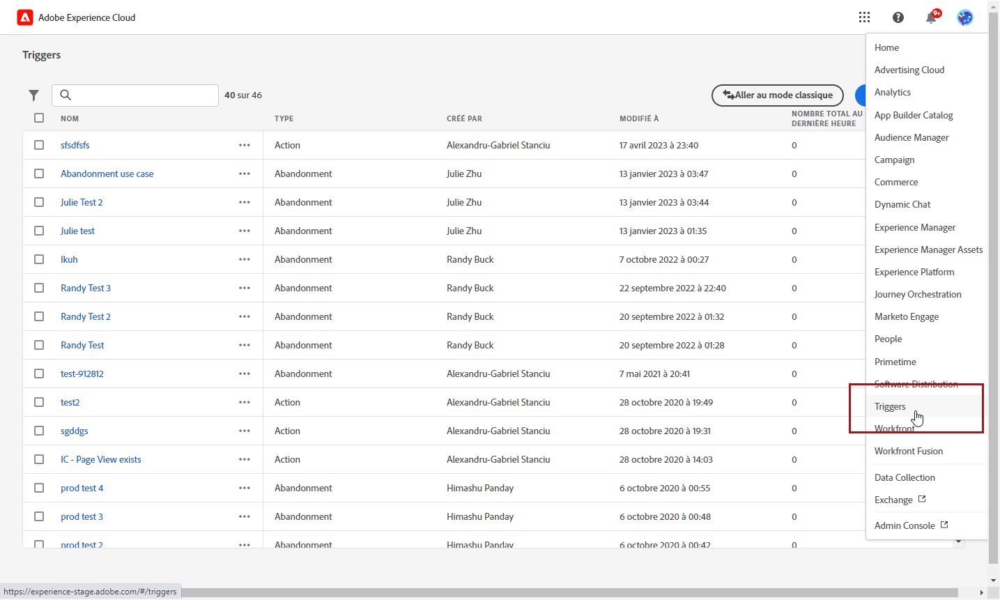
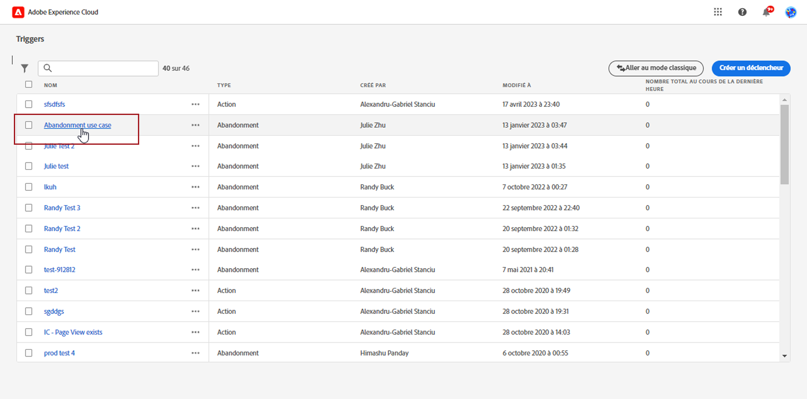

# Créer un trigger Experience Cloud {#create-triggers}

>[!AVAILABILITY]
>
>La nouvelle interface utilisateur d’Adobe Experience Cloud Triggers est progressivement disponible pour toute la clientèle. Pour en savoir plus, contactez votre représentant ou représentante Adobe.

Créez un trigger et configurez les conditions correspondantes. Vous pouvez par exemple indiquer les critères des règles d’un trigger pendant une visite, comme des mesures telles que Abandon du panier ou des dimensions telles que le nom du produit. Lorsque les règles sont satisfaites, le trigger s’exécute.

>[!NOTE]
>
> La nouvelle interface utilisateur d’Experience Cloud Triggers offre une expérience intuitive qui facilite la gestion des comportements des consommateurs et consommatrices ainsi que la personnalisation des expériences utilisateur. Pour revenir à l’interface précédente, cliquez sur le bouton **[!UICONTROL Accéder au mode classique]**.

1. Dans Experience Cloud, sélectionnez le menu de sélection des solutions, puis **[!UICONTROL Triggers]**.

   

1. Sur la page d’accueil de Triggers, cliquez sur **[!UICONTROL Créer un déclencheur]**, puis indiquez le type de déclencheur.

   Trois types de déclencheurs sont disponibles :

   * **[!UICONTROL Abandon ]** : vous pouvez créer un déclencheur qui s’exécute lorsqu’un visiteur ou une visiteuse consulte un produit mais ne l’ajoute pas au panier.

   * **[!UICONTROL Action ]** : vous pouvez créer des déclencheurs, par exemple, pour qu’ils s’exécutent après une inscription à une newsletter, un abonnement par e-mail ou une demande de cartes de crédit (confirmations). Si vous êtes un détaillant, vous pouvez créer un trigger pour un visiteur qui s’inscrit à un programme de fidélité. Dans le secteur des médias et du divertissement, créez des triggers pour les visiteurs qui regardent un programme en particulier et qui doivent répondre à une enquête.

   * **[!UICONTROL Début et fin de session]** : créez un déclencheur pour les événements de début et de fin de session.

   

1. Ajoutez un **[!UICONTROL nom]** et une **[!UICONTROL description]** à votre déclencheur.

1. Sélectionnez la **[!UICONTROL suite de rapports]** Analytics utilisée pour ce déclencheur. Ce paramètre identifie les données de rapport à utiliser.

   [En savoir plus sur la suite de rapports](https://experienceleague.adobe.com/docs/analytics/admin/admin-tools/manage-report-suites/c-new-report-suite/t-create-a-report-suite.html?lang=fr){target="_blank"}.

1. Choisissez le **[!UICONTROL déclencheur après aucune action pour]** la période de validité.

1. Dans les catégories **[!UICONTROL La visite doit inclure]** et **[!UICONTROL La visite ne doit pas inclure]**, vous pouvez définir les critères ou les comportements de visiteur ou visiteuse que vous souhaitez voir se produire ou non. Vous pouvez indiquer une logique **Et** ou **Ou** au sein des conditions ou entre des conditions, en fonction des critères que vous avez déterminés.

   Par exemple, les règles pour un trigger d’abandon de panier simple peuvent ressembler à celles-ci :

   * **[!UICONTROL La visite doit inclure]** : `Carts (metric) Is greater or equal to 1` pour cibler les visiteurs et visiteuses qui ont au moins un article dans leur panier.
   * **[!UICONTROL La visite ne doit pas inclure]** : `Checkout (metric) Exists.` pour supprimer les visiteurs et visiteuses qui ont acheté les articles placés dans leur panier.

   

1. Cliquez sur **[!UICONTROL Conteneur]** pour établir et enregistrer les règles, les conditions ou les filtres qui définissent un déclencheur. Pour que des événements se produisent en même temps, vous devez les placer dans le même conteneur.

   Chaque conteneur est traité indépendamment au niveau des accès. Cela signifie que si deux conteneurs sont associés à l’opérateur **[!UICONTROL Et]**, les règles ne sont éligibles que si deux accès répondent aux exigences.

1. Dans la **[!UICONTROL Métadonnées]** champ, cliquez sur **[!UICONTROL + Dimension]** pour sélectionner une dimension Campaign particulière ou des variables pertinentes pour le comportement d’un visiteur.

   

1. Cliquez sur **[!UICONTROL Enregistrer]**.

1. Sélectionnez votre **[!UICONTROL déclencheur]** récemment créé dans la liste pour accéder à son rapport détaillé.

   

1. Dans la vue détaillée de votre déclencheur, vous pouvez accéder aux rapports sur le nombre de déclencheurs exécutés. Si nécessaire, vous pouvez modifier le déclencheur à l’aide de l’icône en forme de crayon.

   
